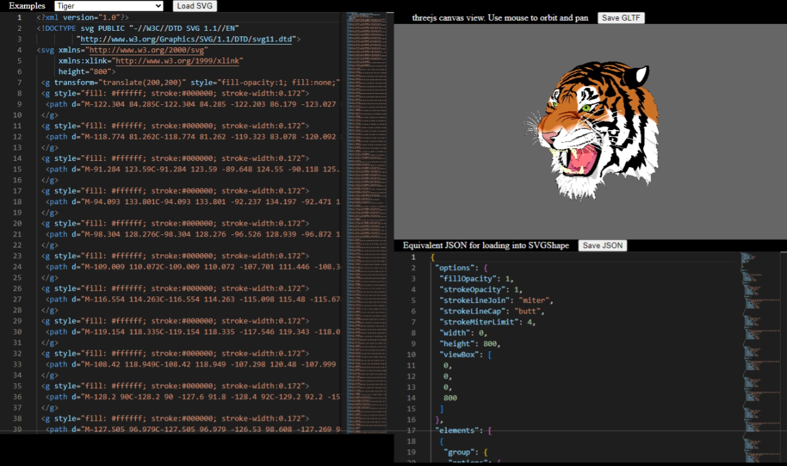

# three-svg-ts

[three-svg-js](https://github.com/IRobot1/three-svg-ts/tree/master/projects/three-svg-js) is a library for working with SVG content in a threejs scene.  

Its still under active development. Updates and improvements may have breaking changes.

#### [Live Demo](https://threesvgjs.z9.web.core.windows.net/)

Demonstrates most of the capabilities of the library

* list of SVG examples
* shows live preview of how the SVG looks in a threejs scene
* allows loading SVG files from you local storage
* allows saving SVGShape to .glft file
* provides monaco editor for pasting and editing SVG with live update
* shows JSON equivelent to SVG document. Can be saved to .json file




## Installing three-svg-js Library

To install [three-svg-js](https://github.com/IRobot1/three-svg-ts/tree/master/projects/three-svg-js) library 

```
npm install three-svg-js
```

## Local Development

Download or clone this repo, then

```
npm install
ng serve -o
```

Angular is only used to demo the library. The library does not depend on Angular.
